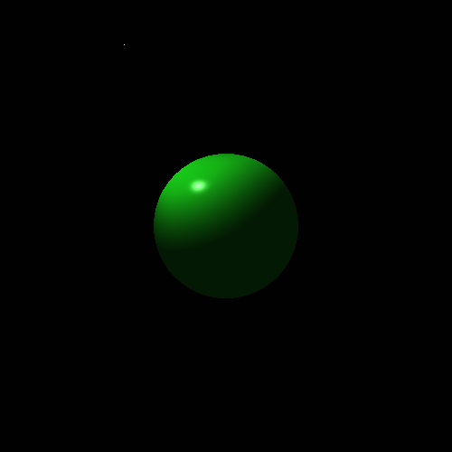

# Fragment Shader

A fragment shader that implements the Phong reflection model with orthographic projection.
The shader renders a sphere of emerald color with a light over it.
The light moves circularly to show the reflection model working.

__Sample Image__

[Show with WebGL](http://htmlpreview.github.io/?https://github.com/santiagoviertel/fragment-shader/blob/master/index.html)

- __Platforms__: Linux and Windows __(not tested)__
- __Programming language__: GLSL and HTML
- __Last code change__: 02/16/2020